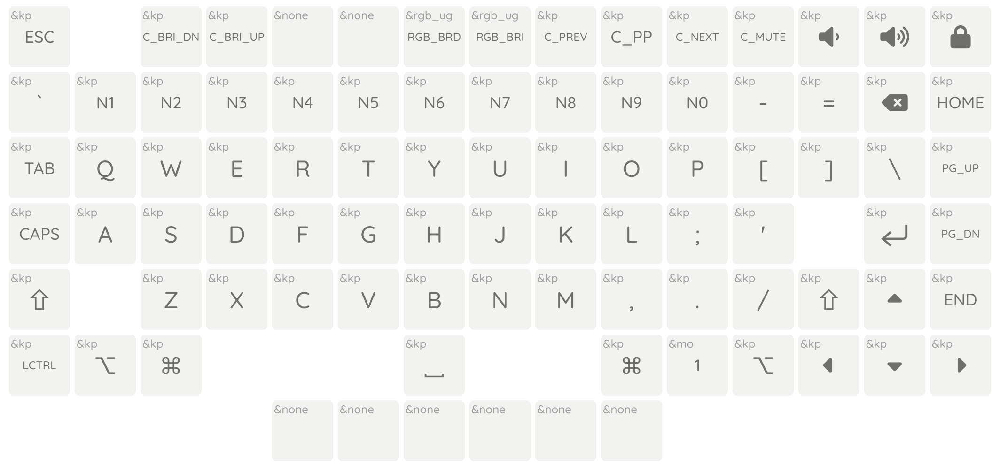

HW-75 Keyboard
==========

本目录是 HW-75 键盘主体的 ZMK 配置。

## PCB

本配置支持下列版本的 PCB。烧录时请注意区分：

| PCB 版本 | 文件名 | 备注 |
|--------|--------------------|------|
| Ver1.1 | `hw75@1.1-zmk.bin` | [立创开源](https://oshwhub.com/pengzhihui/b11afae464c54a3e8d0f77e1f92dc7b7)版，大部分开源团使用的版本 |
| Ver1.2 | `hw75@1.2-zmk.bin` | Xikii 500 人试作团、哔哩哔哩会员购版 |

## 烧录

1. 从 [Releases](https://github.com/xingrz/zmk-config_helloword_hw-75/releases/latest) 下载最新的固件。请注意区分 PCB 版本；
2. 参考[这篇文章的步骤](https://www.zfrontier.com/app/flow/xKYXEy6AqWra)完成准备工作，并烧入固件。

## 快速定制

你可以直接 Fork 本仓库到自己账号名下，并启用 GitHub Actions。修改提交相关文件之后，在自己的 Actions 中耐心等待云端编译完成，然后下载固件并烧录。

### 布局



本固件默认为针对 Mac 用户的按键布局 (并且屏蔽了触摸条)。如果你需要在 Windows 上使用，可以将本仓库 Fork 到自己账号下之后使用 [ZMK Keymap Editor](https://nickcoutsos.github.io/keymap-editor/) 修改，或手动编辑 [`hw75.keymap`](/config/hw75.keymap) 文件。然后等待云端编译出新的固件。

### 灯效

ZMK 默认带了几种灯效。可以通过 Fn 组合键切换：

* `Fn` + `Tab`: 开关
* `Fn` + `Q`/`A`: 切换效果
* `Fn` + `W`/`S`: 调整亮度
* `Fn` + `E`/`D`: 调整色相
* `Fn` + `R`/`F`: 调整饱和度
* `Fn` + `T`/`G`: 调整动画速度

## 二次开发

参考 [ZMK 的上手文档](https://zmk.dev/docs/development/setup#prerequisites)。

```sh
export ZEPHYR_TOOLCHAIN_VARIANT=gnuarmemb
export GNUARMEMB_TOOLCHAIN_PATH=/path/to/gcc-arm-none-eabi-10.3-2021.10

west init -l config
west update
west zephyr-export
west build -s zmk/app -b hw75 -- -DZMK_CONFIG=$PWD/config
west flash
```

默认会构建最新 PCB 版本的配置。如果你需要构建不同版本，可以使用下面的命令：

```sh
west build -p -s zmk/app -b hw75@1.1 -- -DZMK_CONFIG=$PWD/config -DKEYMAP_FILE=$PWD/config/hw75.keymap
```

## 相关链接

* [使用开源的 DAPLink 调试器及 pyOCD 烧录程序](https://github.com/peng-zhihui/HelloWord-Keyboard/discussions/76)
* [一个只有 4KB 的 DFU bootloader](https://github.com/peng-zhihui/HelloWord-Keyboard/discussions/77)
